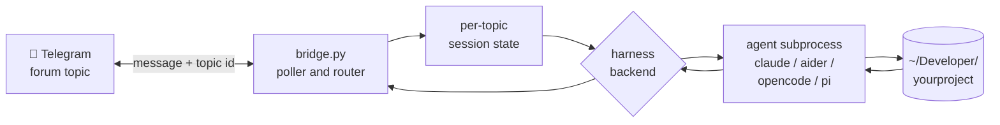

# Stargate

**Run AI coding agents on your computer, from your phone.**

Stargate bridges Telegram to AI coding agents running on your own machine — Claude Code, the Claude Agent SDK, Aider, OpenCode, and more — letting you develop software, manage infrastructure, and run autonomous agents from a mobile messaging app while your real workstation does the actual work.

---

## Why this exists

I run a one-person indie shop from a Mac Mini in a closet. No laptop. The phone in my pocket is the only screen I carry around. Most "AI coding from your phone" tools mean talking to a chatbot with no access to your real code, your real tools, or your real environment — which is fine for asking questions, useless for actual work. I wanted the opposite: my actual machine, my actual repos, my actual `git` and `uv` and `tuist` and `cargo`, driven from anywhere.

The trick was realizing Telegram already had the right shape. Forum-mode group topics are just persistent threaded conversations — give each topic its own working directory and its own agent session, and now your phone becomes a multi-project remote control. Topic `#fanta` is an agent session in `~/Developer/Fanta`. Topic `#deskdays` is one in `~/Developer/deskdays`. Switch between them by tapping a topic. Each one has full filesystem access, full tool access, full process control, on the actual machine where your work lives.

Stargate is the transport layer that makes this work: a Python service that listens for Telegram messages, routes each to the right project + agent + harness, runs the turn, and streams the response back. It survives its own self-edits, recovers from its own crashes, and does not care which agent you choose to put behind it.

## How I actually use it

- **Cover letter drafts on a 4-hour flight.** Topic `#lighthouse` is bound to my career-search agent. I dictate the JD into Telegram, the agent reads my work history, drafts a tailored cover letter, and writes it to my Obsidian vault. By the time I land, three letters are ready for review.
- **Debugging Hugo deploys from a coffee shop.** Topic `#synodic-co` is bound to the website repo. `tail of bridge.log says 503 from CF Pages` — the agent pulls Cloudflare logs, finds the misconfigured redirect, fixes the `_redirects` file, commits, deploys, and replies "fixed, live in 30s."
- **Triaging email on the bus.** Topic `#buddy` runs my email-triage agent. It batches overnight inbox into priority buckets, flags anything that needs me, drafts responses for the rest. I tap reply, dictate edits, it sends.
- **Watching a build self-heal at dinner.** Stargate's own bridge crashed with a parser bug while I was eating. Crash-loop detection fired a self-heal session, which read the traceback, found the bug, wrote the fix, validated it, and restarted. I got a Telegram message saying "fixed, recovered, here's the diff."
- **Setting up new repos in 90 seconds.** `spin up a new repo for X with the standard pre-push hooks` — the agent creates the GitHub repo, configures branch protection via the API, sets up the `develop`/`production` convention, copies in the linting hooks, commits the initial scaffold. I never leave Telegram.

The unifying property: my phone never has to do real work. The Mac Mini does. My phone is just the keyboard.

## Architecture



Each Telegram forum topic maps to an independent agent session. Multiple topics run in parallel, each with its own project directory, harness backend, and session state. Sessions persist across messages and auto-expire after configurable inactivity.

### Module map

```
bridge.py                 Entrypoint -- Telegram handlers, commands, lifecycle
stargate/                 Core package
  config.py               Environment variables, paths, constants, logging
  sessions.py             Session persistence, sanitization, pending messages
  parser.py               Claude CLI output parsing (JSON array, NDJSON, single-object)
  quota.py                Quota/rate-limit detection and queue handoff
  activity.py             Structured JSON-lines activity logging
  projects.py             Chat-to-project directory mapping
  self_heal.py            Crash-loop / corrupt-session repair dispatcher
  singleton.py            Single-instance lock (avoids 409 getUpdates conflicts)
  harness/                Pluggable agent backends
    base.py               Protocol + TurnEvent types + ChannelHandle protocol
    claude_cli.py         Claude Code CLI subprocess
    claude_sdk.py         Claude Agent SDK (typed messages, mid-turn push)
    claude_sdk_channel.py Long-lived ClaudeSDKClient for inflight push
    aider.py              Aider with chat-history-file resume
    opencode.py           sst/opencode JSON event protocol
    pi.py                 badlogicgames/pi multi-model agent
auth.py                   Authentication state management (Apple Sign In + TOTP)
auth_server.py            FastAPI server for Sign in with Apple OIDC flow
validate.py               Pre-flight validation (syntax, imports, parser smoke tests)
run.sh                    Entry point with crash-loop detection and self-healing
```

## Design decisions

### Forum topics as sessions, not chats

A single Telegram chat would force the user to pick "what project am I working on" with every message. By making each forum topic an independent session, the user picks the project once when they enter the topic; routing is implicit thereafter. Multi-project work becomes tab-switching. Group permissions and notifications work per topic, so silencing or pinning a project is one tap.

### Pluggable harness, single transport

The bridge does not care which agent runs the turn. The `Harness` protocol (`stargate/harness/base.py`) is a streaming-event interface that all backends conform to: Claude Code CLI, Claude Agent SDK, Aider, OpenCode, badlogicgames/pi. New harnesses can be added by implementing one class. Capabilities (resume, mid-turn push, MCP, tool streaming) are advertised via `HarnessCapabilities` so the bridge can degrade gracefully when a backend doesn't support a feature.

### Crash-loop self-heal

Stargate is frequently edited by an agent running *through itself*, which means a bad self-edit could brick the bridge. Three or more crashes in five minutes triggers an autonomous Claude Code session that reads the traceback, diagnoses the bug, writes the fix, validates it, and restarts. Self-heal incidents are logged to `activity.jsonl` so they are visible in the soak-test dashboard.

### Pre-flight validation as known-good rollback

Before every bridge start, `validate.py` runs syntax checks, import checks, and parser smoke tests on the current source. If any fail, `run.sh` rolls back to a `.bridge-known-good.py` snapshot and starts that instead. This means a syntactically broken self-edit cannot stop the bridge from running.

### Single-instance lock, self-stealing

Two bridge processes polling Telegram's `getUpdates` simultaneously will trigger 409 conflicts, log them 1000 times each, and never exit cleanly. `stargate/singleton.py` holds an exclusive lock on `.bridge.lock`. If a stale PID is holding it (process is dead), the new bridge steals it and continues. If a live PID holds it, the new bridge waits for it to exit, then takes over. No babysitting required during launchd restarts.

### 708 tests, all in plain pytest

Test suite is 708 tests across 47 test files covering the bridge, the parser, every harness, all command handlers, the auth flow, the self-heal path, the singleton lock, and chaos cases (partial JSON, slow drip, hangs, OOM-style exits). Pre-push hook runs the full suite. No CI on the remote — quality gates are local.

## Features

- **Multi-harness** — Claude Code CLI, Claude Agent SDK, Aider, OpenCode, badlogicgames/pi. Switch per topic via `/harness <name>`.
- **Multi-project routing** — Each Telegram topic binds to a project directory via `chat_projects.json`. Each topic can target a different codebase.
- **Per-topic agent identity** — Topics can load identity files (e.g. `SOUL.md`, `IDENTITY.md`, `AGENTS.md`) into the agent's system prompt to specialize behavior per persona.
- **Sign in with Apple** — Optional OIDC authentication via Apple's identity service with IP pinning, absolute expiry, and inactivity timeout.
- **TOTP authentication** — Alternative auth method using standard authenticator apps (Google Authenticator, Authy, 1Password).
- **Crash recovery** — Self-healing crash-loop detection: 3+ crashes in 5 minutes triggers an autonomous repair session.
- **Pre-flight validation** — `validate.py` checks syntax, imports, and parser behavior before every bridge start. On failure, rolls back to a known-good snapshot.
- **Quota handoff** — When the agent hits a rate limit, the task is written to a queue file for background processing.
- **Rich messaging** — Markdown rendering, code blocks, photo and image handling with captions.
- **Pending message batching** — Messages arriving while the agent is processing are queued and batched into a single follow-up invocation.
- **Mid-turn push (cc-sdk only)** — On harnesses that support streaming input, follow-up messages are injected into the active turn at the next natural break — no queue, no friction reply.
- **Remote control** — Start `claude remote-control` sessions from Telegram for direct CLI access.
- **Session persistence** — Sessions resume across messages and bridge restarts.

## Self-host walkthrough

Anyone with a Mac and 30 minutes should be able to follow this end-to-end.

### 1. Prerequisites

- macOS (uses launchd for process management)
- Python 3.13+
- [uv](https://docs.astral.sh/uv/) for dependency management
- An agent CLI installed locally (any of: [Claude Code](https://docs.anthropic.com/en/docs/claude-code), [Aider](https://aider.chat/), [OpenCode](https://github.com/sst/opencode), [pi](https://github.com/badlogicgames/pi))

### 2. Get a Telegram bot

1. Message [@BotFather](https://t.me/BotFather) on Telegram, run `/newbot`, follow the prompts.
2. Save the bot token he gives you. This goes in `.env` as `TELEGRAM_BOT_TOKEN`.
3. Get your Telegram user ID by messaging [@userinfobot](https://t.me/userinfobot). This goes in `.env` as `ALLOWED_USER_IDS` (comma-separated if multiple).

### 3. Make a forum-mode group

1. Telegram → New Group → add your bot.
2. Group settings → "Topics" → enable. (This converts the group into a forum.)
3. Make the bot an admin with permission to read all messages and post in topics.
4. Find the chat ID by sending a message and reading `bridge.log` once stargate is running, or by using a tool like [@RawDataBot](https://t.me/RawDataBot).

### 4. Clone and configure

```bash
git clone https://github.com/synodic-studio/stargate.git
cd stargate
uv sync

# Configure environment
cp .env.example .env
# Edit .env: set TELEGRAM_BOT_TOKEN, ALLOWED_USER_IDS, CLAUDE_PATH, CLAUDE_WORKING_DIR

# Optional: pre-bind topics to projects
cp chat_projects.example.json chat_projects.json
# Edit chat_projects.json with your real chat-and-thread IDs and project dirs
```

### 5. Smoke test

```bash
./run.sh
# In another terminal:
tail -f logs/bridge.log
```

Send a message in any topic. The bridge logs the chat-and-thread ID; copy it into `chat_projects.json`, set the project directory, and the next message routes to that project.

### 6. Persist as a launchd service

```bash
# Update paths in com.synodic.claude-telegram-bridge.plist (look for YOURUSER placeholders)
cp com.synodic.claude-telegram-bridge.plist ~/Library/LaunchAgents/com.synodic.stargate.plist
launchctl load ~/Library/LaunchAgents/com.synodic.stargate.plist
```

The plist sets `KeepAlive: SuccessfulExit=false` so the bridge auto-restarts on crash, with a 30-second `ThrottleInterval` backstop to prevent rapid-fire restart storms. `run.sh` does pre-flight validation; if `validate.py` fails, it rolls back to a known-good snapshot.

### 7. Optional: Sign in with Apple

For multi-user or stronger auth, set `AUTH_REQUIRED=true` in `.env`, configure the `APPLE_*` variables (Services ID, key, redirect URL), and run `run_auth.sh` as a second launchd service. Without auth, all messages from `ALLOWED_USER_IDS` pass through.

**TOTP** can be set up per user as an alternative:

```bash
uv run setup_totp.py --user-id <telegram-user-id>
```

## Telegram commands

| Command | Auth | Description |
|---|---|---|
| `/start` | No | Show command list and your Telegram user ID |
| `/auth` | No | Send auth link or show current session info |
| `/lock` | Yes | Lock your session (`/lock all` locks all sessions) |
| `/clearnew` | No | Start a fresh session (conversation history lost) |
| `/setproject` | No | Bind topic to a project directory |
| `/project` | No | Show current project and agent for this topic |
| `/harness <name>` | No | Switch the agent backend for this topic |
| `/kill` | Yes | Kill the active agent subprocess (session preserved) |
| `/restart` | Yes | Restart the bridge process |
| `/remote_control` | Yes | Start/stop a `claude remote-control` session |
| `/ping` | No | Liveness check with active session status |

## Self-edit safety

The bridge is frequently edited by an agent running *through itself*. Five layers prevent self-edits from bricking it:

1. **`validate.py`** — Standalone validation: syntax check, import check, parser smoke tests
2. **`run.sh` pre-flight** — Runs `validate.py` before starting; rolls back to known-good on failure
3. **Crash loop detection** — 3+ crashes in 5 minutes triggers an autonomous self-heal session
4. **`/restart` gate** — Validates before restarting; blocks restart on failure
5. **`ThrottleInterval: 30`** in launchd — backstop against rapid respawn

## Development

```bash
uv run pytest tests/ -q                                 # run tests (708 tests)
uv run ruff check .                                     # lint
uv run python validate.py                               # pre-flight smoke tests
uv run pytest tests/ --cov --cov-report=term-missing    # with coverage
```

Pre-push hook runs the full test suite. There is no CI on the remote — quality gates are local.

## License

MIT
